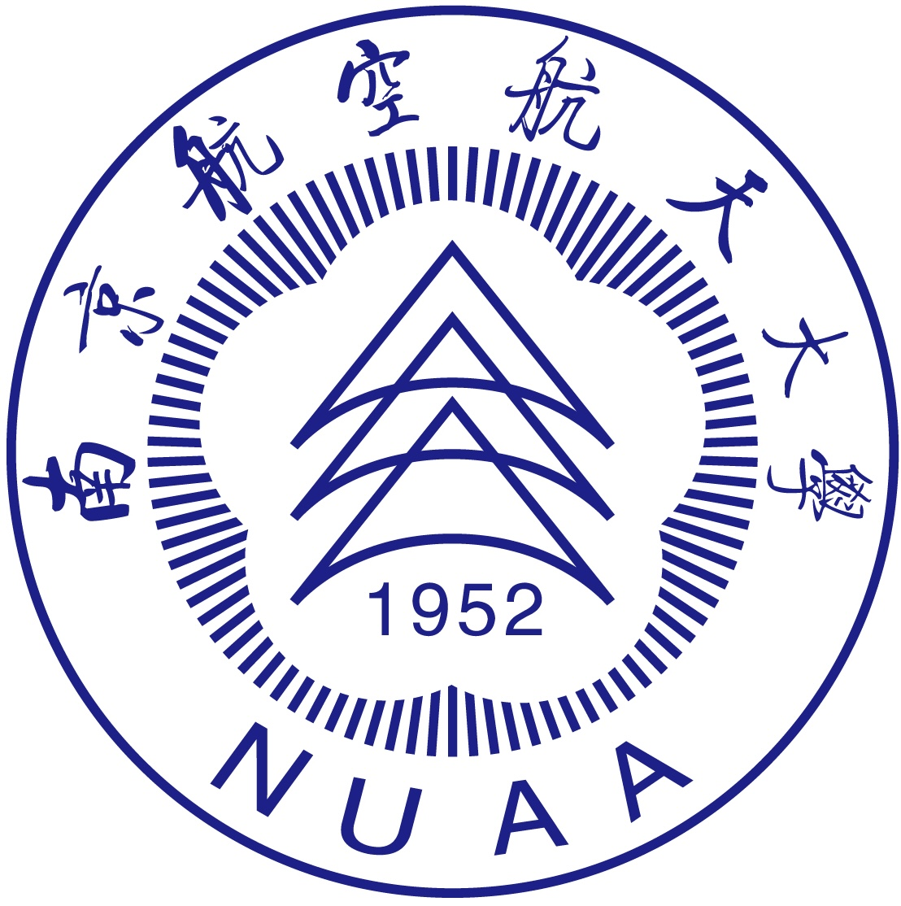

I'm a final-year undergraduate student from <a href="https://cs.nuaa.edu.cn/">College of Computer Science and Technology</a>, 
  <a href="https://nuaa.edu.cn/">NUAA</a>. My research interest includes intelligent IoT, LEO satellite network, autonomous robot navigation.  

 
<h2>Education</h2>

  

    Nanjing University of Aeronautics and Astronautics, China  
    B.Eng. in  Internet of Things Engineering, 2021~2025 (expected)  
  

  

    
  

<!DOCTYPE html>
<html lang="zh">

</html>