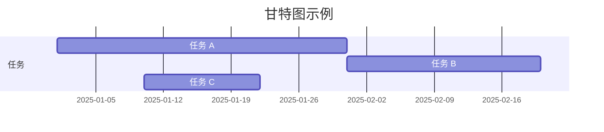
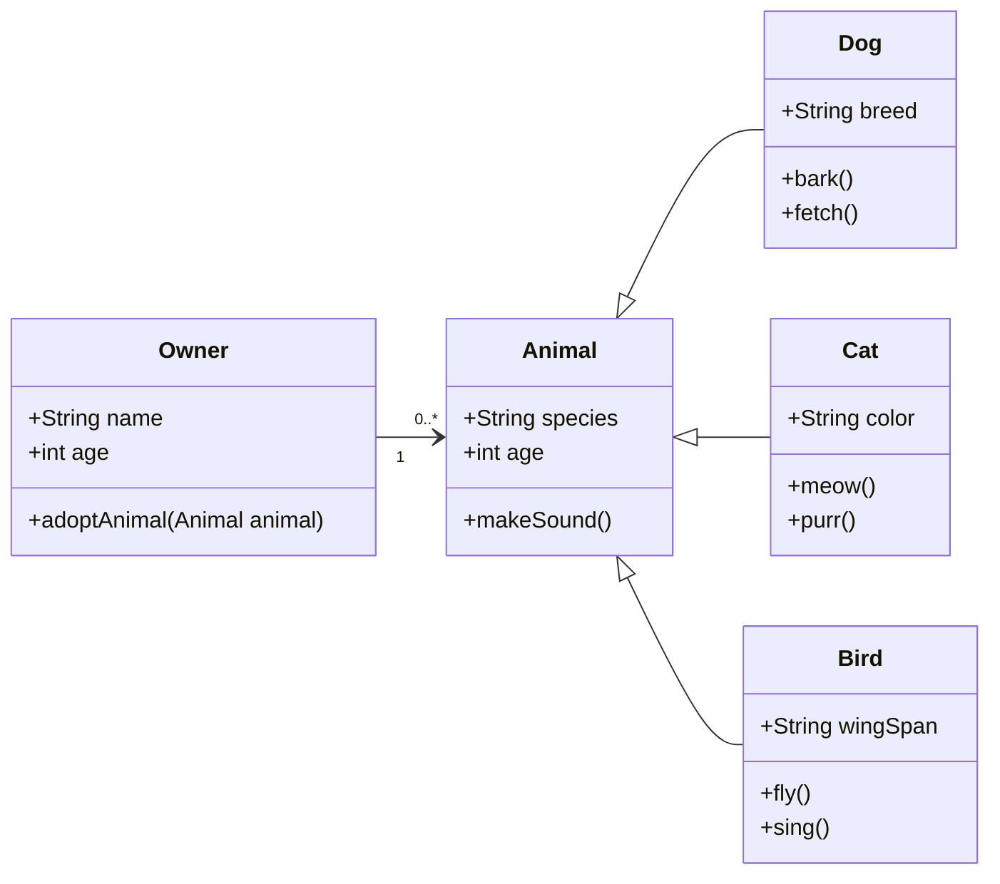

## 数学公式

此主题支持使用[MathJax 3](https://www.mathjax.org/)引擎以行内和显示模式渲染美观的数学公式。
您只需要用`$$`包围您的数学表达式，比如`$$ E = mc^2 $$`。
如果您将它放在段落内，它会产生一个行内表达式，就像 $$ E = mc^2 $$。

实际上，您也可以使用单个美元符号`$`来创建行内公式，比如`$ E = mc^2 $`，它会渲染为 $ E = mc^2 $。这种方法在基于TeX的编译过程中提供相同的效果，但在视觉上比双美元符号`$$`显得稍微不那么粗体，使其与周围文本更自然地融合。

要使用显示模式，请再次用`$$`包围您的表达式并将其作为单独的段落。
这里是一个例子：

$$
\left( \sum_{k=1}^n a_k b_k \right)^2 \leq \left( \sum_{k=1}^n a_k^2 \right) \left( \sum_{k=1}^n b_k^2 \right)
$$

请注意，MathJax 3是[MathJax的重大重写](https://docs.mathjax.org/en/latest/upgrading/whats-new-3.0.html)，带来了加载和渲染速度的显著提升，现在[与KaTeX相当](http://www.intmath.com/cg5/katex-mathjax-comparison.php)。

---

## 引用

文章正文中使用 `<d-cite>` 标签进行引用。  
`key` 属性对应参考文献中的 `id`，多个引用可用逗号分隔。

引用以内联数字形式呈现：<d-cite key="gregor2015draw"></d-cite>（鼠标悬停可查看详细信息）。  
如果您有附录，系统会自动在其中生成参考文献列表。

Distill 采用数字内联引用风格，以提升高密度引用文章的可读性。  
不过，若在正文中深入讨论某项工作，建议提及作者姓氏，这是对研究者的基本尊重。

---

## 脚注

只需将您希望作为脚注的内容包裹在 `<d-footnote>` 标签中，脚注编号将自动生成。<d-footnote>这将变成一个可悬停的脚注。</d-footnote>

---

## 代码块

语法高亮通过 `<d-code>` 标签提供。  
行内代码示例：`<d-code language="html">let x = 10;</d-code>`。

对于大段代码，请添加 `block` 属性：

<d-code block language="javascript">
  var x = 25;
  function(x) {
    return x * x;
  }
</d-code>

**注意**：`<d-code>` 块在深色模式下显示效果不佳。建议改用标准 Jekyll 语法高亮：


var x = 25;
function(x) {
return x \* x;
}


您也可以使用标准 Markdown 三反引号代码块：

```python
def foo(x):
  return x
```

---

## 交互式图表

可通过 Plotly + iframe 嵌入交互式图表：

<div class="l-page">
  <iframe src="{{ '/assets/plotly/demo.html' | relative_url }}" frameborder='0' scrolling='no' height="500px" width="100%" style="border: 1px dashed grey;"></iframe>
</div>

图表需预先生成并保存为 HTML 文件。
生成上述图表的 Python 代码如下：


import pandas as pd
import plotly.express as px
df = pd.read_csv(
'https://raw.githubusercontent.com/plotly/datasets/master/earthquakes-23k.csv'
)
fig = px.density_mapbox(
df,
lat='Latitude',
lon='Longitude',
z='Magnitude',
radius=10,
center=dict(lat=0, lon=180),
zoom=0,
mapbox_style="stamen-terrain",
)
fig.show()
fig.write_html('assets/plotly/demo.html')


---

## 折叠框

折叠框可隐藏额外信息，使用 `details` liquid 标签：


额外内容，其中数学公式 $$ 2x - 1 $$ 和 `code` 均可正确渲染。


---

## Mermaid

本主题支持在 Markdown 中直接使用 [Mermaid](https://mermaid.js.org/). 创建图表。Mermaid 可以渲染流程图、时序图、类图、甘特图等多种图形。只需将图表语法嵌入到 Mermaid 代码块中即可。

要创建甘特图，可以使用以下语法：

````markdown

````

渲染效果如下：


同样，你也可以用它创建美观的类图：

````

````

渲染效果如下：


借助 Mermaid，你可以轻松添加清晰且动态的图表，从而提升博客内容的表现力。

---

## Diff2Html

本主题还支持集成 [Diff2Html](https://github.com/rtfpessoa/diff2html)，这是一款能将代码差异（diffs）以美观方式直接渲染到 Markdown 中的工具。Diff2Html 非常适合用于展示代码变更，能够清晰地呈现新增、删除和修改的内容。它特别适用于代码审查、技术文档和教程等场景，尤其当你需要逐步高亮代码改动时——甚至可以同时展示多个文件的变更。

````markdown
```diff2html
diff --git a/utils/mathUtils.js b/utils/mathUtils.js
index 3b5f3d1..c7f9b2e 100644
--- a/utils/mathUtils.js
+++ b/utils/mathUtils.js
@@ -1,8 +1,12 @@
-// 基础数学工具函数
+// 扩展的数学工具函数，包含更多功能

-export function calculateArea(radius) {
-    const PI = 3.14159;
+export function calculateCircleMetrics(radius) {
+    const PI = Math.PI;
     const area = PI * radius ** 2;
+    const circumference = 2 * PI * radius;
+
+    if (!isValidRadius(radius)) throw new Error("半径无效");
+
     return { area, circumference };
 }

-export function validateRadius(radius) {
+export function isValidRadius(radius) {
     return typeof radius === 'number' && radius > 0;
 }

diff --git a/main.js b/main.js
index 5f6a9c3..b7d4e8f 100644
--- a/main.js
+++ b/main.js
@@ -2,9 +2,12 @@
 import { calculateCircleMetrics } from './utils/mathUtils';

-function displayCircleMetrics(radius) {
-    const { area } = calculateCircleMetrics(radius);
+function displayCircleMetrics(radius) {
+    const { area, circumference } = calculateCircleMetrics(radius);
     console.log(`面积: ${area}`);
+    console.log(`周长: ${circumference}`);
 }

-displayCircleMetrics(5);
+try {
+    displayCircleMetrics(5);
+} catch (error) {
+    console.error("错误:", error.message);
+}
```
````

使用 Diff2Html 渲染后的效果如下：

```diff2html
diff --git a/utils/mathUtils.js b/utils/mathUtils.js
index 3b5f3d1..c7f9b2e 100644
--- a/utils/mathUtils.js
+++ b/utils/mathUtils.js
@@ -1,8 +1,12 @@
-// 基础数学工具函数
+// 扩展的数学工具函数，包含更多功能

-export function calculateArea(radius) {
-    const PI = 3.14159;
+export function calculateCircleMetrics(radius) {
+    const PI = Math.PI;
     const area = PI * radius ** 2;
+    const circumference = 2 * PI * radius;
+
+    if (!isValidRadius(radius)) throw new Error("半径无效");
+
     return { area, circumference };
 }

-export function validateRadius(radius) {
+export function isValidRadius(radius) {
     return typeof radius === 'number' && radius > 0;
 }

diff --git a/main.js b/main.js
index 5f6a9c3..b7d4e8f 100644
--- a/main.js
+++ b/main.js
@@ -2,9 +2,12 @@
 import { calculateCircleMetrics } from './utils/mathUtils';

-function displayCircleMetrics(radius) {
-    const { area } = calculateCircleMetrics(radius);
+function displayCircleMetrics(radius) {
+    const { area, circumference } = calculateCircleMetrics(radius);
     console.log(`面积: ${area}`);
+    console.log(`周长: ${circumference}`);
 }

-displayCircleMetrics(5);
+try {
+    displayCircleMetrics(5);
+} catch (error) {
+    console.error("错误:", error.message);
+}
```

---

## Leaflet

[Leaflet](https://leafletjs.com/) 由乌克兰软件工程师 [Volodymyr Agafonkin](https://agafonkin.com/) 创建，是一款轻量级、开源的 JavaScript 库，用于在网页中嵌入交互式地图。Leaflet 支持 [GeoJSON 数据](https://geojson.org/)，可轻松高亮特定地理区域，从而细致地可视化地理信息。

你可以使用以下代码在 [OpenStreetMap](https://www.openstreetmap.org/) 上加载地图信息：

````markdown
```geojson
{
  "type": "FeatureCollection",
  "features": [
    {
      "type": "Feature",
      "properties": {
        "name": "克里米亚",
        "popupContent": "被占领的克里米亚"
      },
      "geometry": {
        "type": "Polygon",
        "coordinates": [
          [
            [
              33.9,
              45.3
            ],
            [
              36.5,
              45.3
            ],
            [
              36.5,
              44.4
            ],
            [
              33.9,
              44.4
            ],
            [
              33.9,
              45.3
            ]
          ]
        ]
      }
    },
    {
      "type": "Feature",
      "properties": {
        "name": "顿涅茨克",
        "popupContent": "被占领的顿涅茨克"
      },
      "geometry": {
        "type": "Polygon",
        "coordinates": [
          [
            [
              37.5,
              48.5
            ],
            [
              39.5,
              48.5
            ],
            [
              39.5,
              47.5
            ],
            [
              37.5,
              47.5
            ],
            [
              37.5,
              48.5
            ]
          ]
        ]
      }
    },
    {
      "type": "Feature",
      "properties": {
        "name": "卢甘斯克",
        "popupContent": "被占领的卢甘斯克"
      },
      "geometry": {
        "type": "Polygon",
        "coordinates": [
          [
            [
              38.5,
              49.5
            ],
            [
              40.5,
              49.5
            ],
            [
              40.5,
              48.5
            ],
            [
              38.5,
              48.5
            ],
            [
              38.5,
              49.5
            ]
          ]
        ]
      }
    },
    {
      "type": "Feature",
      "properties": {
        "name": "赫尔松",
        "popupContent": "被占领的赫尔松"
      },
      "geometry": {
        "type": "Polygon",
        "coordinates": [
          [
            [
              32.3,
              47.3
            ],
            [
              34.3,
              47.3
            ],
            [
              34.3,
              46.3
            ],
            [
              32.3,
              46.3
            ],
            [
              32.3,
              47.3
            ]
          ]
        ]
      }
    },
    {
      "type": "Feature",
      "properties": {
        "name": "扎波罗热",
        "popupContent": "被占领的扎波罗热"
      },
      "geometry": {
        "type": "Polygon",
        "coordinates": [
          [
            [
              34.3,
              48
            ],
            [
              36.3,
              48
            ],
            [
              36.3,
              47
            ],
            [
              34.3,
              47
            ],
            [
              34.3,
              48
            ]
          ]
        ]
      }
    }
  ]
}
```
````

渲染后的地图如下所示，高亮显示了多年来被俄罗斯非法占领的乌克兰地区，包括克里米亚及四个东部地区：

```geojson
{
  "type": "FeatureCollection",
  "features": [
    {
      "type": "Feature",
      "properties": {
        "name": "克里米亚",
        "popupContent": "被占领的克里米亚"
      },
      "geometry": {
        "type": "Polygon",
        "coordinates": [
          [
            [33.9, 45.3],
            [36.5, 45.3],
            [36.5, 44.4],
            [33.9, 44.4],
            [33.9, 45.3]
          ]
        ]
      }
    },
    {
      "type": "Feature",
      "properties": {
        "name": "顿涅茨克",
        "popupContent": "被占领的顿涅茨克"
      },
      "geometry": {
        "type": "Polygon",
        "coordinates": [
          [
            [37.5, 48.5],
            [39.5, 48.5],
            [39.5, 47.5],
            [37.5, 47.5],
            [37.5, 48.5]
          ]
        ]
      }
    },
    {
      "type": "Feature",
      "properties": {
        "name": "卢甘斯克",
        "popupContent": "被占领的卢甘斯克"
      },
      "geometry": {
        "type": "Polygon",
        "coordinates": [
          [
            [38.5, 49.5],
            [40.5, 49.5],
            [40.5, 48.5],
            [38.5, 48.5],
            [38.5, 49.5]
          ]
        ]
      }
    },
    {
      "type": "Feature",
      "properties": {
        "name": "赫尔松",
        "popupContent": "被占领的赫尔松"
      },
      "geometry": {
        "type": "Polygon",
        "coordinates": [
          [
            [32.3, 47.3],
            [34.3, 47.3],
            [34.3, 46.3],
            [32.3, 46.3],
            [32.3, 47.3]
          ]
        ]
      }
    },
    {
      "type": "Feature",
      "properties": {
        "name": "扎波罗热",
        "popupContent": "被占领的扎波罗热"
      },
      "geometry": {
        "type": "Polygon",
        "coordinates": [
          [
            [34.3, 48],
            [36.3, 48],
            [36.3, 47],
            [34.3, 47],
            [34.3, 48]
          ]
        ]
      }
    }
  ]
}
```

> ##### DANGER
>
> 本段内容为原模板翻译，不代表本人观点或立场。文中所述仅为原作者意见，本人对其内容不持任何政治立场，亦不承担相关责任。
{: .block-danger }

---

## Chartjs、Echarts 与 Vega-Lite

[Chart.js](https://www.chartjs.org/) 是一个功能丰富且灵活的 JavaScript 图表库，用于创建响应式和交互式图表。它支持多种图表类型，如柱状图、折线图、饼图和雷达图，是直接在网页中可视化数据的理想工具。

以下是一个使用 JSON 配置创建 Chart.js 柱状图的示例：

````
```chartjs
{
  "type": "bar",
  "data": {
    "labels": ["2017", "2018", "2019", "2020", "2021"],
    "datasets": [
      {
        "label": "人口（百万）",
        "data": [12, 15, 13, 14, 16],
        "backgroundColor": "rgba(54, 162, 235, 0.6)",
        "borderColor": "rgba(54, 162, 235, 1)",
        "borderWidth": 1
      }
    ]
  },
  "options": {
    "scales": {
      "y": {
        "beginAtZero": true
      }
    }
  }
}
```
````

渲染后的柱状图展示了 2017 年至 2021 年的人口数据：

```chartjs
{
  "type": "bar",
  "data": {
    "labels": ["2017", "2018", "2019", "2020", "2021"],
    "datasets": [
      {
        "label": "人口（百万）",
        "data": [12, 15, 13, 14, 16],
        "backgroundColor": "rgba(54, 162, 235, 0.6)",
        "borderColor": "rgba(54, 162, 235, 1)",
        "borderWidth": 1
      }
    ]
  },
  "options": {
    "scales": {
      "y": {
        "beginAtZero": true
      }
    }
  }
}
```

---

[ECharts](https://echarts.apache.org/) 是由 [Apache](https://www.apache.org/) 开发的一款功能强大的可视化库，支持多种交互式图表，包括更高级的类型，如散点图、热力图和地理地图。

以下 JSON 配置创建了一个视觉效果增强的折线图，用于展示两种产品的月度销售数据。

````
```echarts
{
  "title": {
    "text": "月度销售对比",
    "left": "center"
  },
  "tooltip": {
    "trigger": "axis",
    "backgroundColor": "rgba(50, 50, 50, 0.7)",
    "borderColor": "#777",
    "borderWidth": 1,
    "textStyle": {
      "color": "#fff"
    }
  },
  "legend": {
    "data": ["产品 A", "产品 B"],
    "top": "10%"
  },
  "xAxis": {
    "type": "category",
    "data": ["1月", "2月", "3月", "4月", "5月", "6月", "7月", "8月", "9月", "10月", "11月", "12月"],
    "axisLine": {
      "lineStyle": {
        "color": "#888"
      }
    }
  },
  "yAxis": {
    "type": "value",
    "axisLine": {
      "lineStyle": {
        "color": "#888"
      }
    },
    "splitLine": {
      "lineStyle": {
        "type": "dashed"
      }
    }
  },
  "series": [
    {
      "name": "产品 A",
      "type": "line",
      "smooth": true,
      "data": [820, 932, 901, 934, 1290, 1330, 1320, 1400, 1450, 1500, 1600, 1650],
      "itemStyle": {
        "color": "#5470C6"
      },
      "lineStyle": {
        "width": 3
      },
      "areaStyle": {
        "color": {
          "type": "linear",
          "x": 0,
          "y": 0,
          "x2": 0,
          "y2": 1,
          "colorStops": [
            { "offset": 0, "color": "rgba(84, 112, 198, 0.5)" },
            { "offset": 1, "color": "rgba(84, 112, 198, 0)" }
          ]
        }
      },
      "emphasis": {
        "focus": "series"
      }
    },
    {
      "name": "产品 B",
      "type": "line",
      "smooth": true,
      "data": [620, 732, 701, 734, 1090, 1130, 1120, 1200, 1250, 1300, 1400, 1450],
      "itemStyle": {
        "color": "#91CC75"
      },
      "lineStyle": {
        "width": 3
      },
      "areaStyle": {
        "color": {
          "type": "linear",
          "x": 0,
          "y": 0,
          "x2": 0,
          "y2": 1,
          "colorStops": [
            { "offset": 0, "color": "rgba(145, 204, 117, 0.5)" },
            { "offset": 1, "color": "rgba(145, 204, 117, 0)" }
          ]
        }
      },
      "emphasis": {
        "focus": "series"
      }
    }
  ]
}
```
````

渲染结果如下所示，您也可以使用鼠标与其进行交互：

```echarts
{
  "title": {
    "text": "月度销售对比",
    "left": "center"
  },
  "tooltip": {
    "trigger": "axis",
    "backgroundColor": "rgba(50, 50, 50, 0.7)",
    "borderColor": "#777",
    "borderWidth": 1,
    "textStyle": {
      "color": "#fff"
    }
  },
  "legend": {
    "data": ["产品 A", "产品 B"],
    "top": "10%"
  },
  "xAxis": {
    "type": "category",
    "data": ["1月", "2月", "3月", "4月", "5月", "6月", "7月", "8月", "9月", "10月", "11月", "12月"],
    "axisLine": {
      "lineStyle": {
        "color": "#888"
      }
    }
  },
  "yAxis": {
    "type": "value",
    "axisLine": {
      "lineStyle": {
        "color": "#888"
      }
    },
    "splitLine": {
      "lineStyle": {
        "type": "dashed"
      }
    }
  },
  "series": [
    {
      "name": "产品 A",
      "type": "line",
      "smooth": true,
      "data": [820, 932, 901, 934, 1290, 1330, 1320, 1400, 1450, 1500, 1600, 1650],
      "itemStyle": {
        "color": "#5470C6"
      },
      "lineStyle": {
        "width": 3
      },
      "areaStyle": {
        "color": {
          "type": "linear",
          "x": 0,
          "y": 0,
          "x2": 0,
          "y2": 1,
          "colorStops": [
            { "offset": 0, "color": "rgba(84, 112, 198, 0.5)" },
            { "offset": 1, "color": "rgba(84, 112, 198, 0)" }
          ]
        }
      },
      "emphasis": {
        "focus": "series"
      }
    },
    {
      "name": "产品 B",
      "type": "line",
      "smooth": true,
      "data": [620, 732, 701, 734, 1090, 1130, 1120, 1200, 1250, 1300, 1400, 1450],
      "itemStyle": {
        "color": "#91CC75"
      },
      "lineStyle": {
        "width": 3
      },
      "areaStyle": {
        "color": {
          "type": "linear",
          "x": 0,
          "y": 0,
          "x2": 0,
          "y2": 1,
          "colorStops": [
            { "offset": 0, "color": "rgba(145, 204, 117, 0.5)" },
            { "offset": 1, "color": "rgba(145, 204, 117, 0)" }
          ]
        }
      },
      "emphasis": {
        "focus": "series"
      }
    }
  ]
}
```

---

[Vega-Lite](https://vega.github.io/vega-lite/) 是一种声明式的可视化语法，允许用户创建、共享并自定义各种交互式数据可视化图表。以下 JSON 配置生成了一个简洁的柱状图：

````
```vega_lite
{
  "$schema": "https://vega.github.io/schema/vega/v5.json",
  "width": 400,
  "height": 200,
  "padding": 5,

  "data": [
    {
      "name": "table",
      "values": [
        {"category": "A", "value": 28},
        {"category": "B", "value": 55},
        {"category": "C", "value": 43},
        {"category": "D", "value": 91},
        {"category": "E", "value": 81},
        {"category": "F", "value": 53},
        {"category": "G", "value": 19},
        {"category": "H", "value": 87}
      ]
    }
  ],

  "scales": [
    {
      "name": "xscale",
      "type": "band",
      "domain": {"data": "table", "field": "category"},
      "range": "width",
      "padding": 0.1
    },
    {
      "name": "yscale",
      "type": "linear",
      "domain": {"data": "table", "field": "value"},
      "nice": true,
      "range": "height"
    }
  ],

  "axes": [
    {"orient": "bottom", "scale": "xscale"},
    {"orient": "left", "scale": "yscale"}
  ],

  "marks": [
    {
      "type": "rect",
      "from": {"data": "table"},
      "encode": {
        "enter": {
          "x": {"scale": "xscale", "field": "category"},
          "width": {"scale": "xscale", "band": 0.8},
          "y": {"scale": "yscale", "field": "value"},
          "y2": {"scale": "yscale", "value": 0},
          "fill": {"value": "steelblue"}
        },
        "update": {
          "fillOpacity": {"value": 1}
        },
        "hover": {
          "fill": {"value": "orange"}
        }
      }
    }
  ]
}
```
````

渲染结果展示了一个干净简洁的柱状图，并带有悬停交互效果：

```vega_lite
{
  "$schema": "https://vega.github.io/schema/vega/v5.json",
  "width": 400,
  "height": 200,
  "padding": 5,

  "data": [
    {
      "name": "table",
      "values": [
        {"category": "A", "value": 28},
        {"category": "B", "value": 55},
        {"category": "C", "value": 43},
        {"category": "D", "value": 91},
        {"category": "E", "value": 81},
        {"category": "F", "value": 53},
        {"category": "G", "value": 19},
        {"category": "H", "value": 87}
      ]
    }
  ],

  "scales": [
    {
      "name": "xscale",
      "type": "band",
      "domain": {"data": "table", "field": "category"},
      "range": "width",
      "padding": 0.1
    },
    {
      "name": "yscale",
      "type": "linear",
      "domain": {"data": "table", "field": "value"},
      "nice": true,
      "range": "height"
    }
  ],

  "axes": [
    {"orient": "bottom", "scale": "xscale"},
    {"orient": "left", "scale": "yscale"}
  ],

  "marks": [
    {
      "type": "rect",
      "from": {"data": "table"},
      "encode": {
        "enter": {
          "x": {"scale": "xscale", "field": "category"},
          "width": {"scale": "xscale", "band": 0.8},
          "y": {"scale": "yscale", "field": "value"},
          "y2": {"scale": "yscale", "value": 0},
          "fill": {"value": "steelblue"}
        },
        "update": {
          "fillOpacity": {"value": 1}
        },
        "hover": {
          "fill": {"value": "orange"}
        }
      }
    }
  ]
}
```

---

## TikZ

[TikZ](https://tikz.net/) 是一款基于 LaTeX 的强大绘图工具，由 [TikZJax](https://tikzjax.com/). Y驱动，可在网页中直接渲染。您可以轻松地将论文、海报或笔记中的 TikZ 图形移植到博客中。例如，以下代码可用于图解欧拉公式 $ e^{i \theta} = \cos \theta + i \sin \theta $：

```markdown
<script type="text/tikz">
\begin{tikzpicture}
    \filldraw[fill=cyan!10, draw=blue, thick] (0,0) circle (2cm);

    \draw[->, thick] (-2.5,0) -- (2.5,0) node[right] {Re};
    \draw[->, thick] (0,-2.5) -- (0,2.5) node[above] {Im};

    \draw[->, thick, color=purple] (0,0) -- (1.5,1.5);
    \node[color=purple] at (1.1, 1.7) {$e^{i\theta}$};

    \draw[thick] (0.7,0) arc (0:45:0.7);
    \node at (0.9, 0.3) {$\theta$};

    \draw[dashed, color=gray] (1.5,1.5) -- (1.5,0) node[below, black] {$\cos \theta$};
    \draw[dashed, color=gray] (1.5,1.5) -- (0,1.5) node[left, black] {$\sin \theta$};
    \node at (2.2, 0) [below] {1};
    \node at (0, 2.2) [left] {$i$};
    \node at (1.5,1.5) [above right, color=blue] {$(\cos \theta \, \sin \theta)$};
\end{tikzpicture}
</script>
```

渲染结果如下所示，以矢量图形形式呈现：

<script type="text/tikz">
\begin{tikzpicture}
    \filldraw[fill=cyan!10, draw=blue, thick] (0,0) circle (2cm);

    \draw[->, thick] (-2.5,0) -- (2.5,0) node[right] {Re};
    \draw[->, thick] (0,-2.5) -- (0,2.5) node[above] {Im};

    \draw[->, thick, color=purple] (0,0) -- (1.5,1.5);
    \node[color=purple] at (1.1, 1.7) {$e^{i\theta}$};

    \draw[thick] (0.7,0) arc (0:45:0.7);
    \node at (0.9, 0.3) {$\theta$};

    \draw[dashed, color=gray] (1.5,1.5) -- (1.5,0) node[below, black] {$\cos \theta$};
    \draw[dashed, color=gray] (1.5,1.5) -- (0,1.5) node[left, black] {$\sin \theta$};
    \node at (2.2, 0) [below] {1};
    \node at (0, 2.2) [left] {$i$};
    \node at (1.5,1.5) [above right, color=blue] {$(\cos \theta \, \sin \theta)$};
\end{tikzpicture}
</script>

---

## Typograms

[Typograms](https://google.github.io/typograms/) 是一种将文字与图形结合的方式，以清晰且富有视觉吸引力的形式传递信息。Typograms 特别适用于展示简单的示意图、图表和概念图，其中文字与图形紧密融合。以下示例展示了一个简单的 Typogram：

````
```typograms
             ___________________
            /                  /|
           /__________________/ |
          |                  |  |
          |     Distill      |  |
          |                  |  |
          |                  | /
          |__________________|/
```
````

The rendered output is shown below：

```typograms
             ___________________
            /                  /|
           /__________________/ |
          |                  |  |
          |     Distill      |  |
          |                  |  |
          |                  | /
          |__________________|/
```

---

## 布局

主文本区域称为 body ，它是 `d-article` 元素直接子元素的默认布局。

<div class="fake-img l-body">
  <p>.l-body</p>
</div>

若希望图像稍大一些，请使用 `.l-page` ：

<div class="fake-img l-page">
  <p>.l-page</p>
</div>

上述两类布局均有 outset 变体，可使内容略微超出正文区域，例如：

<div class="fake-img l-body-outset">
  <p>.l-body-outset</p>
</div>

<div class="fake-img l-page-outset">
  <p>.l-page-outset</p>
</div>

有时您可能希望使用整个浏览器宽度，此时请使用 `.l-screen` 。您也可以使用其 inset 变体，使内容距离浏览器边缘稍有缩进：

<div class="fake-img l-screen">
  <p>.l-screen</p>
</div>
<div class="fake-img l-screen-inset">
  <p>.l-screen-inset</p>
</div>

最后一种布局 `.l-gutter` 用于边注、旁白和脚注。它在桌面端不会打断 `.l-body` 尺寸文本的正常流式排版（仅在移动端会融入正文）：

<div class="fake-img l-gutter">
  <p>.l-gutter</p>
</div>

---

## 旁注（Sidenotes）

Distill 支持旁注（sidenotes），它们类似于脚注，但会显示在页面的侧边空白处。  
旁注非常适合在不打断正文阅读流的情况下提供额外背景信息或参考文献。

创建旁注主要有两种方式：

**使用 `<aside>` 标签：**

以下代码会在页面侧边创建一个具有 **_Distill 样式_** 的旁注：

```html
<aside><p>这是一个使用 aside 标签的旁注。</p></aside>
```

<aside><p> 这是一个使用 `&lt;aside&gt;` 标签的旁注。</p> </aside>

我们也可以在旁注中添加图片（点击图片可放大查看）：


```html
<aside>
  
  <p>
    F.J. Cole，《阿尔布雷希特·丢勒犀牛在动物学文献中的历史》，载于《科学、医学与历史：科学思想与医学实践演变论文集》（伦敦，1953年），E. Ashworth Underwood 编，第337–356页。引自 Edward Tufte《视觉解释》第71页。
  </p>
</aside>
```



<aside>
  
  <p>F.J. Cole，《阿尔布雷希特·丢勒犀牛在动物学文献中的历史》，载于《科学、医学与历史：科学思想与医学实践演变论文集》（伦敦，1953年），E. Ashworth Underwood 编，第337–356页。引自 Edward Tufte《视觉解释》第71页。</p>
</aside>

旁注中还可以包含公式和链接：

在物理学中，质能等价是指一个系统在其静止参考系中质量与能量之间的关系。二者仅相差一个乘法常数（即光速的平方）以及单位制的不同。

<aside>
  <p>该原理由爱因斯坦著名的公式定义：$E = mc^2$ <a href="https://en.wikipedia.org/wiki/Mass%E2%80%93energy_equivalence" target="_blank">（来源：维基百科）</a></p>
</aside>

**使用 `l-gutter` 类：**

以下代码会创建一个具有 **_al-folio's 样式_** 的旁注：

```html
<div class="l-gutter"><p>这是一个使用 l-gutter 类的旁注。</p></div>
```

<div class="l-gutter">
  <p> 这是一个使用 `l-gutter` 类的旁注。 </p>
</div>

---

## 其他排版样式？

斜体（强调）可使用 _星号_ （`*asterisks*`）或 _下划线_ （`_underscores_`）。

粗体（强强调）可使用双星号（**asterisks**）或双下划线（**underscores**）。

还可以组合使用： **星号和 _下划线_**。

删除线使用两个波浪号：~~删掉这段文字。~~

1. 第一个有序列表项
2. 另一个项
   ⋅⋅\* 无序子列表。
3. 实际数字并不重要，只要是数字即可
   ⋅⋅1. 有序子列表
4. 再来一项。

⋅⋅⋅你可以在列表项中包含正确缩进的段落。注意上面需要一个空行，以及行首至少一个空格（这里我们使用三个空格以对齐原始 Markdown）。

⋅⋅⋅若要在不产生新段落的情况下换行，你需要在行尾加上两个空格。⋅⋅
⋅⋅⋅注意，这一行是独立的，但仍属于同一段落。⋅⋅
⋅⋅⋅（这与典型的 GitHub Flavored Markdown 换行行为不同，在 GFM 中行尾空格不是必需的。）

- 无序列表可以使用星号

* 或减号

- 或加号

[这是一个行内链接](https://www.google.com)

[带标题的行内链接](https://www.google.com "Google 首页")

[这是引用式链接][任意大小写不敏感的引用文本]

[你也可以用数字定义引用式链接][1]

或者留空，直接使用[链接文本本身]。

URL 和尖括号中的 URL 会自动转换为链接：
http://www.example.com 或 <http://www.example.com> ，有时
example.com 也可以（但在 GitHub 上不行）。

这是我们的 Logo（悬停查看标题文字）：

[任意大小写不敏感的引用文本]: https://www.mozilla.org
[1]: http://slashdot.org
[链接文本本身]: http://www.reddit.com

这是我们的 Logo（悬停查看标题文字）：

行内式：


引用式：
![alt text][logo]

[logo]: https://github.com/adam-p/markdown-here/raw/master/src/common/images/icon48.png "Logo 标题文字 2"

行内 `代码` 使用 `反引号包围` 。

```javascript
var s = "JavaScript 语法高亮";
alert(s);
```

```python
s = "Python 语法高亮"
print s
```

```
未指定语言，因此无语法高亮。
但我们可以加入一个 <b>标签</b>。
```

冒号可用于对齐表格列。

| 表格        |     居中     |   靠右 |
| ----------- | :----------: | -----: |
| 第3列       |  右对齐      | $1600  |
| 第2列       |   居中       |   $12  |
| 斑马条纹    |   很整洁     |    $1  |

每列表头下方至少需要三个短横线（---）。  
最外层的竖线（|）是可选的，且你无需让原始 Markdown 对齐得很漂亮。你也可以在表格中使用行内 Markdown。

| Markdown | 更少        | 更美观     |
| -------- | ----------- | ---------- |
| _依然_   | `渲染`      | **漂亮**   |
| 1        | 2           | 3          |

> 引用块在电子邮件中非常有用，可用于模拟回复文本。  
> 这一行属于同一个引用块。

引用结束。

> 这是一段非常长的文字，即使自动换行也会被正确引用。天哪，我们继续写下去，确保它足够长，能为所有人触发换行。哦，你可以在引用块中使用 _Markdown_ 和 **格式**。

这是我们的起始行。

这一行与上面一行之间有两个换行符，因此会成为一个 _独立段落_。

这一行也是一个独立段落，但是…  
这一行只与上一行隔了一个换行符，因此它是同一段落中的 _新一行_。
