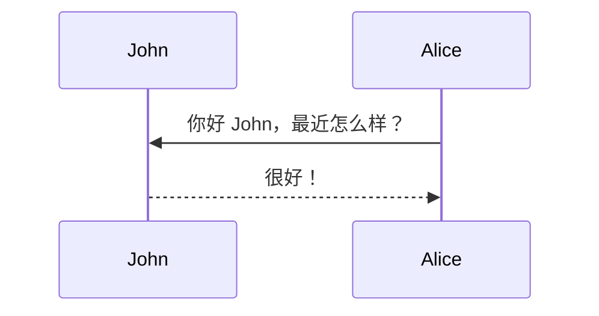

此主题支持使用[mermaid](https://mermaid-js.github.io/mermaid/){:target="\_blank"}从文本描述生成各种图表。以前这是使用[jekyll-diagrams](https://github.com/zhustec/jekyll-diagrams){:target="\_blank"}插件完成的。有关此事的更多信息，请参阅[相关问题](https://github.com/alshedivat/al-folio/issues/1609#issuecomment-1656995674)。要禁用缩放功能，请在此文章的前置元数据中将`mermaid.zoomable`设置为`false`。

## Mermaid

下面的图表是由以下代码生成的：

````markdown

````


